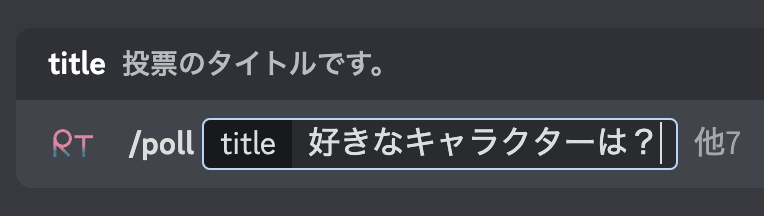
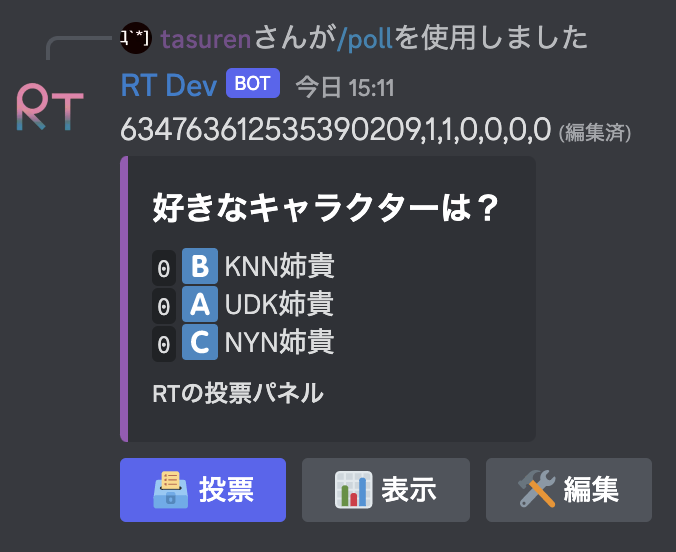

これは投票をするための機能で、`/poll`というコマンドで使います。

## コマンド
### `/poll create`
このコマンドは複数の引数を持っていて、それらの引数は以下です。
- `title` 必須の引数で、投票用のメッセージのタイトルです。
- `details` 投票の説明です。投票用のメッセージに加えられます。
- `max` 一人が同時に投票可能な票の最大個数です。デフォルト：1
- `min` 一人が同時に投票可能な票の最低個数です。デフォルト：1
- `anonymous` 匿名投票とするかどうか。デフォルトは`False`で、匿名投票ではありません。
- `hidden` 締め切りボタンを押すまで投票数を表示しないかどうか。デフォルトは`False`で、リアルタイムで投票状況が表示されます。
- `manageable` 誰でも投票内容を変更可能かどうか。デフォルトは`False`で、作成者のみ変更が可能です。
- `lifetime` 投票できる日数です。デフォルトは`0`で、期限がありません。
### `/poll manage`
このコマンドは、実行者が作った投票パネルの一覧を表示するのと、表示された投票パネルのタイトルを選択ボックスで投票パネルの削除ができるようにしたものです。

## 作成の流れ
### パネルの作成
まず、`/poll`コマンドを実行して投票パネルを作ります。投票パネルとは、投票内容を提示するためのメッセージのことです。  
#### 例

### 編集画面
パネルにある「編集」というボタンを押すことで、パネルの内容を変更するためのボタン等が表示されます。  
ここで投票項目の追加や削除を行うことができます。  

### 項目の追加や削除
編集画面の「追加」というボタンを押すことで、投票項目の入力画面が表示されます。
:::note
このとき、投票項目だけでなく絵文字という入力ボックスも表示されます。
これは、投票する際にどれを投票すれば良いかをわかりやすくするためのものです。  
よくわからなければ、最初から入力されている絵文字をそのままにしましょう。
:::
削除は、編集画面の「削除」と表示されている選択ボタンで、削除したい項目を選択することで削除が可能です。
### 投票する
「投票」というボタンを押すことで、どれに投票をするかの選択ボックスが表示されます。それで自分が投票をしたい項目を選択してください。
### 締め切る
締め切るというのは、誰も投票できないようにして、票数を表示された状態で固定するということです。  
これをすると、投票や編集など何もできなくなります。  
これは、編集画面の「締め切る」というボタンを押すことでできます。

## 使用例
### かわい子ちゃんを決める

#### コマンド

### 削除希望

#### コマンド

## 作成限度
RTはサーバー毎に一人25個まで同時に投票データを保持します。もしそれ以上の投票パネルを作りたい場合は、既に作ったものでいらないのを`/poll manage`コマンドで削除するか、投票パネルの編集で締め切りボタンで締め切ってください。